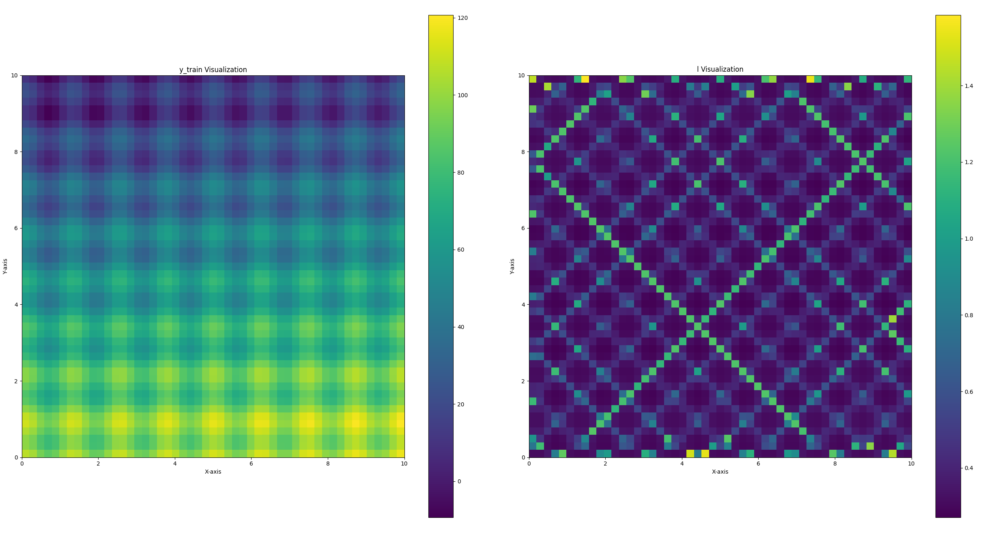

<!--
 * @Author: chasey && melancholycy@gmail.com
 * @Date: 2025-05-17 15:11:53
 * @LastEditTime: 2025-05-17 15:20:40
 * @FilePath: /test/PY_/bgk/independentKlenBGKIRegression/README.md
 * @Description: 
 * @Reference: 
 * Copyright (c) 2025 by chasey && melancholycy@gmail.com, All Rights Reserved. 
-->
# FILE
- `independentKlenBGKI3DRegression.py`  
    - 3D dataset, Elevation Regression  
    - Bayesian Gen... Kernel Inference (Ref:`Shan, T., Wang, J., Englot, B., & Doherty, K. (n.d.). Bayesian Generalized Kernel Inference for Terrain Traversability Mapping.)
    - Independent Kernel-len for every sample
    - result:
    