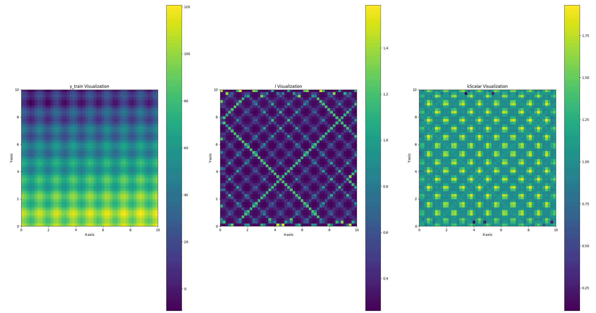
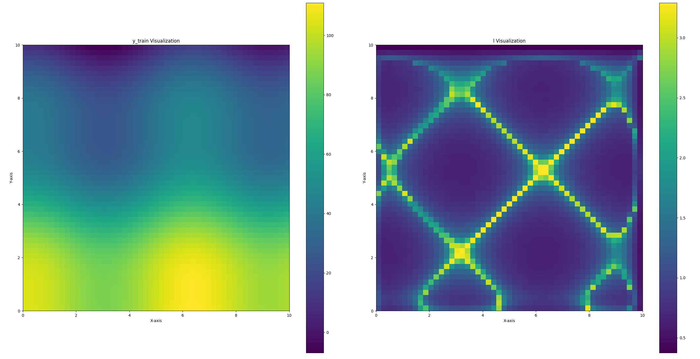
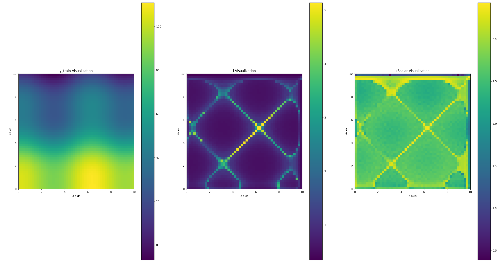
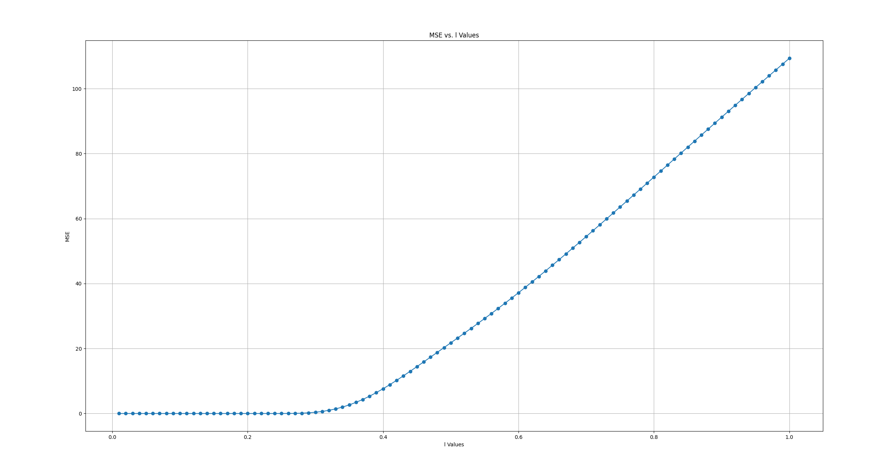

<!--
 * @Author: chasey && melancholycy@gmail.com
 * @Date: 2025-05-17 15:11:53
 * @LastEditTime: 2025-05-18 13:31:55
 * @FilePath: /test/PY_/bgk/independentKlenBGKIRegression/README.md
 * @Description: 
 * @Reference: 
 * Copyright (c) 2025 by chasey && melancholycy@gmail.com, All Rights Reserved. 
-->
# FILE
- `independentKlenBGKI3DRegression.py`  
    - 3D dataset, Elevation Regression  
    - Bayesian Gen... Kernel Inference (Ref:`Shan, T., Wang, J., Englot, B., & Doherty, K. (n.d.). Bayesian Generalized Kernel Inference for Terrain Traversability Mapping.)
    - Independent Kernel-len for every sample
    - result: $Elevation(x, y) = 10 \sin(5x) + 10 \cos(5y) + 10x + y$
    
    - result: $Elevation(x, y) = 10 \sin(x) + 10 \cos(y) + 10x + y$
      
      

# BUG
`onlyPredTest.py`
The positive correlation between MSE and kLen suggests a potential issue with hyperparameter optimization. When trainX and predX are identical, a shorter kernel length better aligns with original values.  
  

