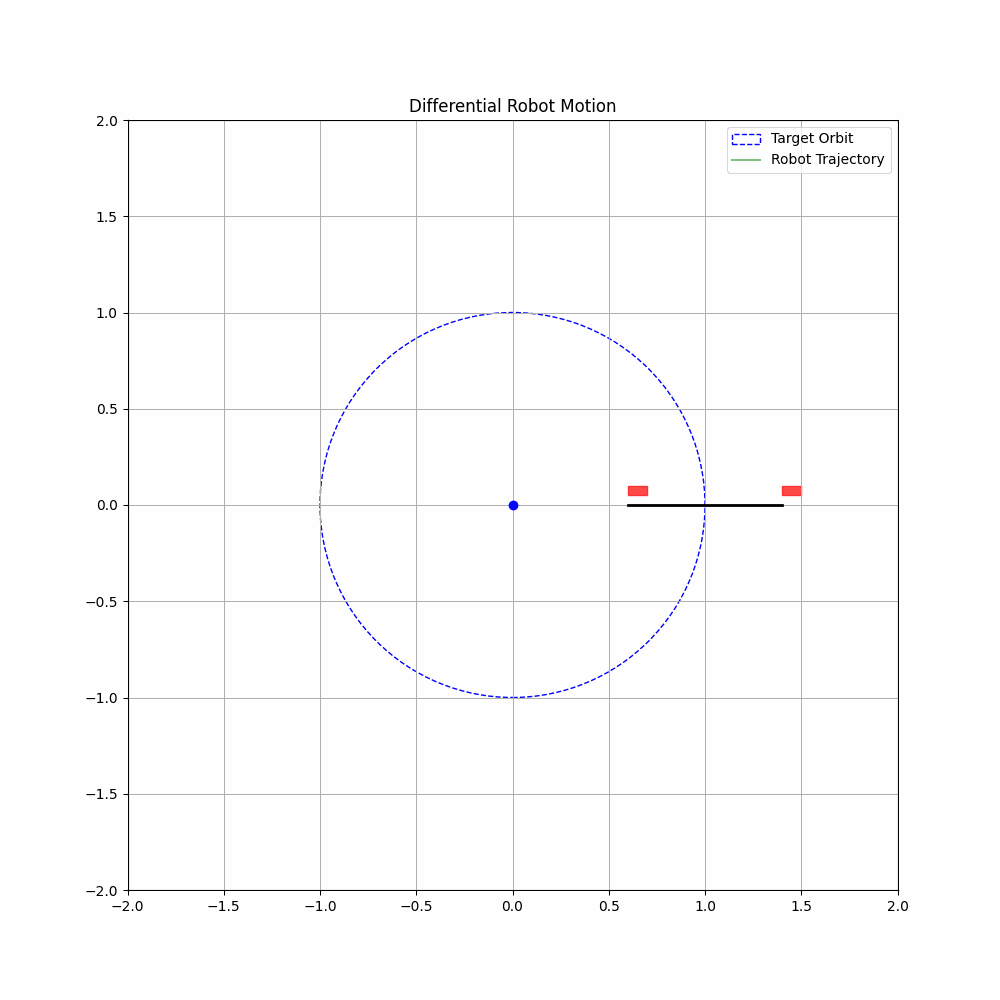

<!--
 * @Author: chasey && melancholycy@gmail.com
 * @Date: 2025-05-30 04:04:22
 * @LastEditTime: 2025-05-30 04:11:50
 * @FilePath: /test/PY_/robot_sim/diffTwoWheel/README.md
 * @Description: 
 * @Reference: 
 * Copyright (c) 2025 by chasey && melancholycy@gmail.com, All Rights Reserved. 
-->
# Introduction  
two wheel diff robot, revolution and rotation at the same time. The result is as follow:
  
It will be used to develop wheeleg-robot to participate in the competition named robomaster, which is held by DJI-Chian  